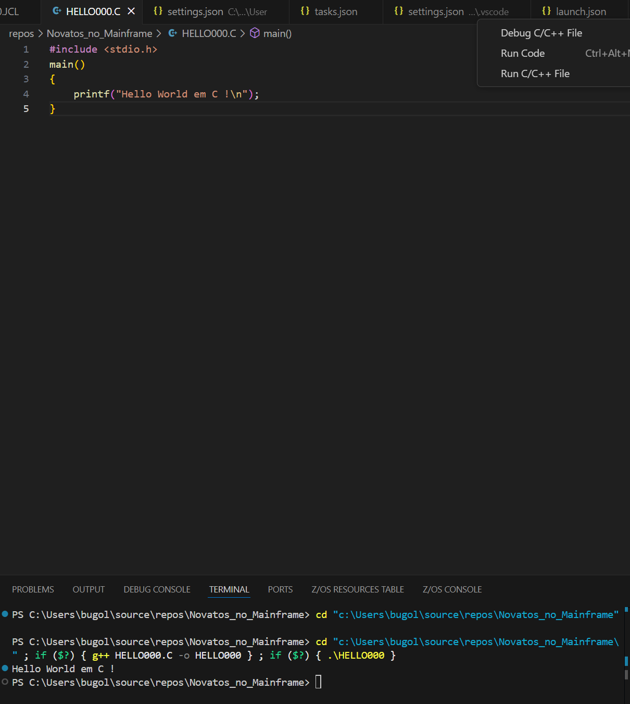
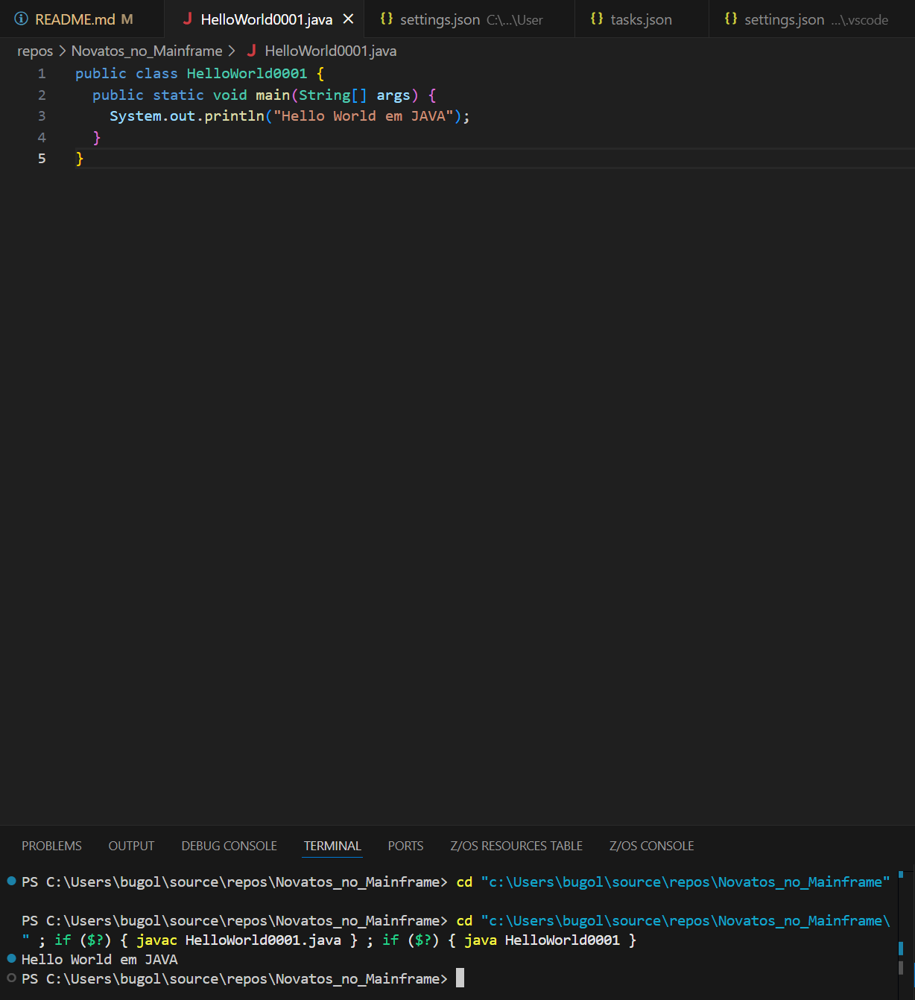
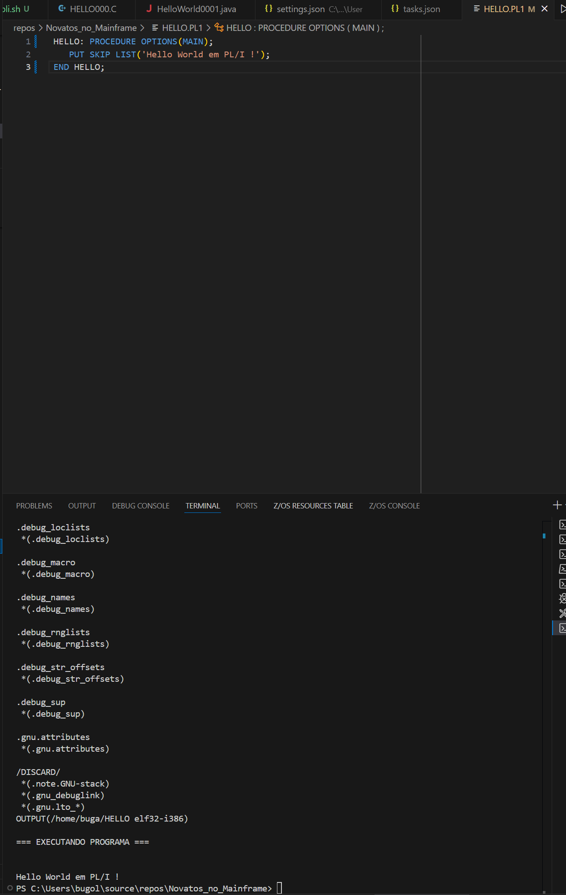

# Novatos_no_Mainframe

  

Codigos fontes dos exemplos que constam no livro

  

## Programas

-  **Hello World**

-  `HELLO000.C` - em C

-  `HELLO000.CBL` - em Cobol

-  `HELLO.ASM` - em HLASM

-  `HELLO.PL1` - em PL/1

-  `OLA#004.REX` - em REXX

-  `HelloWorld0001.java` - em Java

  

## Jobs

-  `JOB#0000.JCL` - Execução Hello World

  

### Chama procedure que Compila / Linka / Go (Executa)

-  `ASM00001.JCL` - CLG Hello World em HLASM

-  `C0000001.JCL` - CLG Hello World C

-  `PL10001.JCL` - CLG Hello World em PL/1

-  `COB0001.JCL` - CLG Hello World em Cobol

  
# 🚀 Gambiarras !!!

**Aqui que a gente se diverte de verdade!**
  
## Compila Linka e Roda - HLASM direto do VSCode no projeto z390

[Link para HLASM no z390](https://drive.google.com/file/d/1RC4Hs_y8hV1DMKUTdsrWN6hlNtPU6StQ/view?usp=sharing)

## Compila Linka e Roda - COBOL direto do VSCode via GNUCobol 

[Link para COBOL via GNUCobol](https://drive.google.com/file/d/1RyDimhJLzOla-AfJINEEu1lOQN11tkHD/view?usp=sharing)

## Compila Linka e Roda - C direto do VSCode via g++ (pacote MinGW)

## Roda Hello World em Java, sem mistério por aqui!

## Compila, Linka e Executa PL/1 da Iron Spring no Linux via wsl direto do Visual Studio Code

[Link para PL/1 linux](https://drive.google.com/file/d/16uHQIxB6M_a9jkcJuXE83Jufh_kmQbdS/view?usp=sharing)

# MVS Turnkey5

Configurações e outros para rodar liso!

Backup em 2025 06 09 - [text](https://drive.google.com/file/d/1Mvn50lmq-omf4xFop_FVB3suvKAu1oqF/view?usp=sharing)

  
Ver sysouts no navegador

**/S HTTPD**

---> http://localhost:8080/jesst.html

  

Iniciar o FTP

**/S FTPD**

  

usuario padrón **HERC01** senha **CUL8TR** e o bom e velho, onipresente, classico ***IBMUSER / SYS1***

  

Submeter o job via leitor de cartões:

No console do Hercules

devinit 00C D:\tk5\jcl\hello2.jcl

  

Pelo PowerShell

Get-Content hello.jcl | .\nc.exe -v -w 5 127.0.0.1 3505

  
  

## MVS Turnkey5

-  `submit_jcl.ps1` - Script de envio de JCL pra processar no mainframe direto do VSCode

-  `teste.jcl` - JOB de teste

-  `log_rotarion.bat` - Job de rotacionamento dos logs do Hercules e do mainframe

-  `tk5.cnf` - Configuração do Hercules 

-  `mvs.bat` - Inicializacao do Hercules seguida do IPL do mainframe
  

## Personal Communications - PCOMM

-  `Teclado_buga.kmp` - Teclado configurado no esquema que o Buga gosta

-  `console.ws` - Configuracao pra conexao do terminal 3270 ao console do mainframe

-  `usuario.ws` - Configuracao pra conexao do terminal 3270 ao TSO